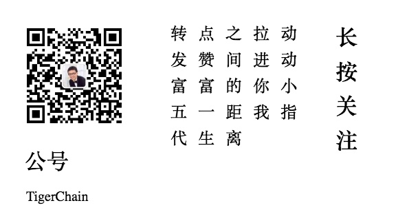

> Demo 的演示效果

[01、基本指令](https://tigerchain.github.io/vue-lesson/01、基本指令/index.html)

[03、Vue--props](https://tigerchain.github.io/vue-lesson/03、Vue--props属性/index.html)

[04、Vue生命周期](https://tigerchain.github.io/vue-lesson/04、Vue生命周期/index.html)

[05、移动webapp适配--rem](https://tigerchain.github.io/vue-lesson/05、移动webapp适配--rem/index.html)

[06、Vue路由](https://tigerchain.github.io/vue-lesson/06、Vue路由/index.html)

[07、几个vue小demo](https://tigerchain.github.io/vue-lesson/07、若干练手Demo/index.html)

[08、vue中使用mint-ui](https://tigerchain.github.io/vue-lesson/08、Mint-UI的使用/index.html)

[09、vue网络请求](https://tigerchain.github.io/vue-lesson/09、vue网络请求/index.html)

### 更多精彩文章等着你来

	</img>

